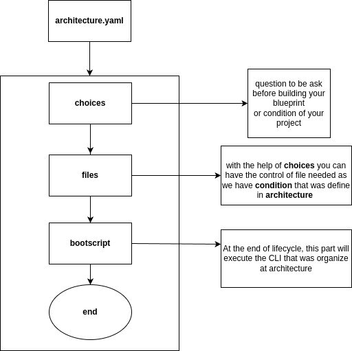

============
Overview
============
Pluton-kit was design as template builder and cli organizer.

This tool supports both requirements in handling your project from scratch to production.

* Project Template builder
* CLI organizer
* Project file and folder design concept

Project Template builder
------------------------
Buiding your project from scratch, looking for reference in building your first application, adding new feature from different template, it waste much time in pondering where to start rather than focus in applying your ideas into product.
That is why I decided to create this tool, help organize my idea and make it modular.

Input(blueprint)
+++++++++++++++++

This is a directory structure for a simple pluton-kit::

    blueprint-root-dir/
    ├── main.tplpy                      <--------- Non-templated files/dirs
    │                                            go outside
    │
    └── architecture.yaml             <--------- Prompts & default values

You must have:

- A ``architecture.yaml`` file.
- A ``main.tplpy`` this file was defined at ``architecture.yaml``, all extension that format ``*.tpl*`` will automatically considered as template .

Beyond that, you can have whatever files/directories will defined at ``architecture.yaml``.

See https://github.com/fonipts/pluton-lobby/tree/main/blueprint for sample we had in declaring blueprint
of this.

Output(Project)
+++++++++++++++

This is a directory structure for a simple plutonkit::

    {{ project_name }}/
    │
    ├── main.py                      <--------- Non-templated files/dirs
    │                                            go outside
    ├── command.yaml                      <--------- cli organizer
    │
    └── project.yaml             <--------- Prompts & default values

You must have:

- A ``project.yaml`` file.
- A ``command.yaml`` file is your cli organizer.
- A ``{{ project_name }}/`` directory, where ``project_name`` is defined in your cli input for customizing your project name.

CLI organizer
----------------

In building application, one of challenging part is how to keep the cli command, sometime we put in text, others in shell script, but most common we place in ``setup.py[python]`` or ``package.js[js]``.
But working in different language dependency, it becomes complicated and hard to maintain. Therefore in library it was decided to have organizer dedicated in cli command

In file ``command.yaml``

 .. code-block:: yaml

   env: {}
    script:
    pip_install:
        command:
        - pip install -r requirements.txt
        description: Install package
    start:
        command:
        - uvicorn main:app

then you can can execute this code in your cli terminal with following

 .. code-block:: shell

   plutonkit cmd start 

or

 .. code-block:: shell

   plutonkit cmd   pip_install
 

Code structure in ``plutonkit cmd`` then you can the file ``command.yaml``

 .. code-block:: yaml

   env: [optional] this is where you will save your environment variable
    win_script: [optional] This will work exclusive on window OS command script, this will part of release ``1.0.25a2``
      [shell command key]:
        command:
        - [required] your ``cli`` argument
        description: [optional] Details of your shell command
    script: [required] Your linux/window(if ``win_script`` does not exist) command script
      [shell command key]:
        command:
        - [required] your ``cli`` argument
        description: [optional] Details of your shell command        

You can check the sample above on how code structure works.

Project file and folder design concept
--------------------------------------

In file ``architecture.yaml``

 .. code-block:: yaml

   name: hello
    settings:
      install_type: pip
    choices:
        - name: name
            question: What is your name
            type: input
        - name: database
            question: What is your Database choice?
            type: single_choice
            option:
            - postgres
            - mysql
            - none
        - name: redis
            question: Do you want Redis?
            type: single_choice
            option:
            - "yes"
            - "no"
    files:
        default:
            - file: main.tplpy
            - file: README.md
        optional:
            - condition: database != "none"
                dependent:
                - file: db.tplpy
                - file: .env

If sample was to long for you, then you can use this simple command to be use as starting guide

.. code-block:: bash

    pip install create_achitecture

Execution cycle in generating your project from blueprint
-------------------------------------------------------
Below representation of how the cycle works in creating your project from the architecture.yaml that was specified above. 

